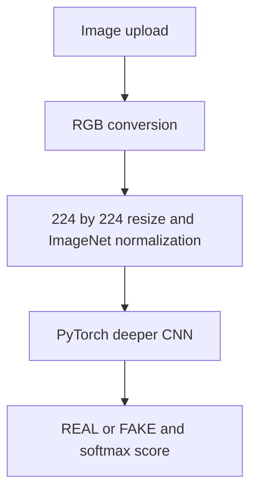

# Image Anti-Spoofing

**Computer-vision experiments connected to a React/FastAPI inference application.**

[Model artifacts](https://huggingface.co/LaabhGupta/image-antispoofing) · [Training notebook](notebooks/FakeVsReal_Image_1.ipynb) · [Serving code](backend/main.py)

Classify images as **REAL** or **FAKE**, where FAKE combines generated and manipulated/deepfake examples. The repository contains a training notebook, three PyTorch architecture definitions, image preprocessing, an inference API and a browser upload interface.

## Dataset & method

The project uses [prithivMLmods/AI-vs-Deepfake-vs-Real](https://huggingface.co/datasets/prithivMLmods/AI-vs-Deepfake-vs-Real). Original Artificial and Deepfake labels are merged into FAKE; Real maps to REAL.



The [model definitions](backend/model.py) include a three-block baseline CNN, a four-block CNN with batch normalization, and ViT-B/16. The API loads **`deeper_cnn_model.pth`** from Hugging Face Hub onto CPU. The training comparison and serving checkpoint are separate choices.

## Reported evaluation

The original project documentation records:

| Model | Test accuracy |
| --- | ---: |
| Baseline CNN | 98.80% |
| Deeper CNN | 99.20% |
| ViT | 100.00% |

These dataset-specific results are not a claim of universal detection. The perfect ViT result warrants scrutiny of split construction, duplicate content and generator overlap. Generalization to unseen generators is not established, and no new benchmark was run for this documentation update. Softmax confidence is not calibrated proof that an image is authentic.

## Run locally

Use Python 3.10 and a Node.js/npm installation compatible with React Scripts 5.

```bash
git clone https://github.com/Laabh-Gupta/Image-Anti-Spoofing.git
cd Image-Anti-Spoofing
python -m venv .venv
```

Activate `.venv`. The following separates the CPU package index from general Python dependencies:

```bash
python -m pip install "numpy<2" fastapi uvicorn python-multipart huggingface_hub pillow
python -m pip install torch==2.2.0 torchvision==0.17.0 --index-url https://download.pytorch.org/whl/cpu
cd backend
python -m uvicorn main:app --host 127.0.0.1 --port 8000
```

Startup downloads the checkpoint. In another terminal:

```bash
cd Image-Anti-Spoofing/frontend
npm install
```

Create `frontend/.env.local` with `REACT_APP_BACKEND_URL=http://127.0.0.1:8000`, then run `npm start`. Open `http://localhost:3000`.

The API accepts multipart field `file` at `POST /predict/`, supporting JPG/JPEG, PNG, WebP and BMP. `GET /` returns basic service status.

## Structure & deployment status

- [backend/](backend/): FastAPI service, model definitions and dependencies.
- [frontend/](frontend/): React upload/results interface.
- [notebooks/](notebooks/): model-training experiment.
- Hugging Face Hub hosts the referenced model artifacts.

No verified public application deployment is claimed here. The current API has broad CORS and no explicit upload-size cap, rate limiter or authentication; those controls need review before broader deployment. The notebook's environment, split and artifacts should be recorded together for reproducible model comparison.

**Python · PyTorch · Torchvision · FastAPI · React · Hugging Face Hub**
